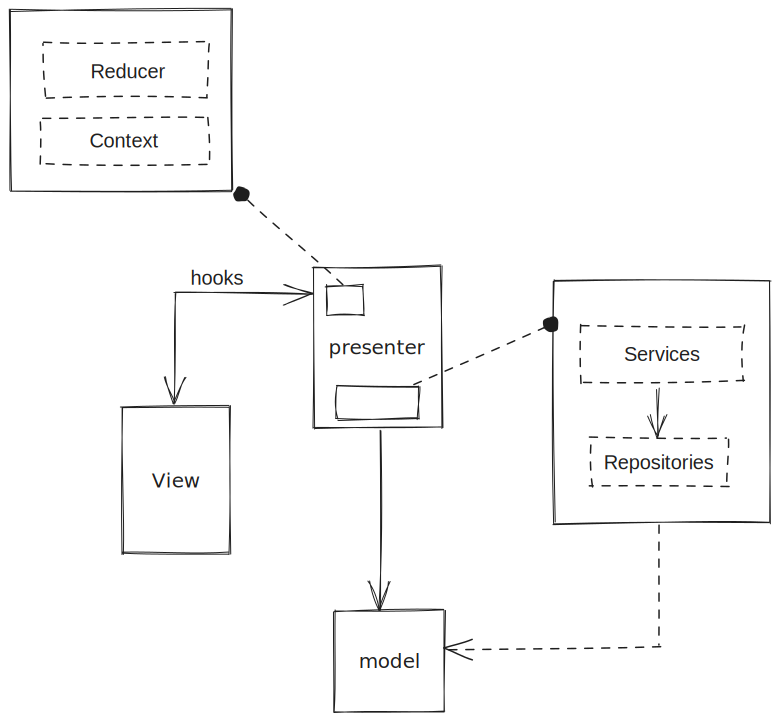

# Getting Started with Create React App

This project was bootstrapped with [Create React App](https://github.com/facebook/create-react-app).

## Starting Scripts

---

In the project directory, you can run:

### `npm run start-mock-server`

Launches the mock server at port 8000.\
If port needs to be change, check the package.json

### `npm start`

Runs the app in the development mode.\
Open [http://localhost:3000](http://localhost:3000) to view it in the browser.

The page will reload if you make edits.\
You will also see any lint errors in the console.

## Libraries used

---

- Mantine
  - Amazing UI library with own hooks for forms

- Class-transformer
  - To work with models in the app code and avoid plain text objects issues. Because working with models is better.

- localforage
  - Great library to work with LocalStorage, IndexedDB or WebSQL

- date-fns
  - Because it is the best library to work with dates.

## Architecture & Design Pattern

---

This implementation is based on DDD architecture following MVP design pattern.\
The main idea is to keep the UI components as render templates while the presenters handle all the model data.\

The presenters just transform the data according to needs of the view. They request or transform all the information needed to the services.\
Also the presenter should manage every single state for the view like forms, notification or modals. In this example app is not yet implemented (see Annotations)

Services are part of the global concept of presenter. Is where all the data transformation is done using the repositories in order to fetch required data.
Repositories are also part of presenter but only through services. Is the entrance point of external data that is transformed to Models.

In this app, a presenter is a React contexts that provides all the functions and state to the views.

### Annotations
  - There are still some logic in the views that should be moved to the presenter.
    - Form state. Currently, this is fully handle by RentForm component.\
      Ideally, the useForm hook should be initiated in the proper presenter. The presenter should accept the params needed to initiate the form and should expose the form state. With this approach, the presenter fully controls the form and notify to the view about the changes.
    - Notifications. In this case the presenter should expose a notification API to the view. With this approach the View is totally agnostic to the notifications and in case on changing the notification service it will be easy.
    - Modals and other overlays. The presenter could expose some delegate function so the view could control modal display information and how it should look.

All of those items are not yet implemented. Fixing them will increase the scalability of the app since we could centralize the logic of each of them making any change straight with minimum impact and cost.

* They are not implemented because I preferred to focus in the logic and the implementation of the rest of architecture.

---

## Missing Requirements

---
 - Bicycle images. All the bicycles have the same image that is not even a bicycle. That's because I did not take care about UI or UX and copied some implemented components and find other images could take time. In any case, the image url should come in the CycleModel from the backend and replacing it should be easy.
 - All elements should be clickable and redirect to the rent page. I did not implement this because, in my opinion, the CycleCard component is very clear where you have to click in order to request the rent.
 - Store the data in localstorage. Since I'm using localforage library and the drivers are set as INDEXEDDB, WEBSQL and LOCALSTORAGE in this order. The data will be stored in these storages falling back to the next one in case the browser is not compatible.

## React components composition

I would have liked to dedicate more time in create composable components (to make them more reusable) rather than big components with tons props, code, logic.\
\
I'm aware that this a negative point for this exercise, but I considered more important the logic behind the views .
